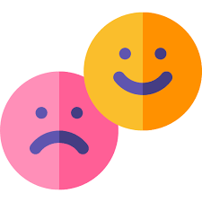

<html>
<head>
	<title>Navoi Presidental School</title>
	<meta charset="utf-8">
	<meta name="viewport" content="width=device-width, initial-scale=1">
	<link rel="stylesheet" type="text/css" href="style1.css">
	<link rel="stylesheet" type="text/css" href="https://cdn.jsdelivr.net/npm/@fortawesome/fontawesome-free@6.2.1/css/fontawesome.min.css">
	
	
</head>
<body>
<section id="banner">
	
	

		<h1><b>NPS</b></h1>
		
Turning your dreams into reality.

		

			<a href="#">Find Out</a>
			<a href="#">Read More</a>
		

	

</section>

	<nav>
	<ul>
		<li><a href="#banner">Home</a></li>
		<li><a href="#feature">About Me!</a></li>
		<li><a href="#service">About Teachers!</a></li>
		<li><a href="#testimonial">International Teachers.</a></li>
		<li><a href="#footer">About School.</a></li>
		<li><a href="#exam">About Exams.</a></li>
	</ul>
	</nav>

	

<!--Features-->

<section id="feature">

About Me!

<h1>Student</h1>

	

		<h1>When I was Born?</h1>
		

			

				
			

			

				
I was Born in 26.04.2011 and I am 11 year old.

			

		

		<h1>Where I was Born?</h1>
		

			

				
			

			

				
I am from Uzbekistan and I was Born in Zarafshan.

			

		

		<h1>Where I study?</h1>
		

			

				
			

			

				
I am from Zarafshan but, I study in Presidental School in <b>Navai<b>.

			

		

	

</section>

<!--Service-->

<section id="service">

About Teachers!

<h1>Our Teachers.</h1>

	

		
		

		

			<h3>Our Teachers</h3>
			

			
Our techers are very smart.

		

	

	

		
		

		

			<h3>Our Teachers</h3>
			

			
Our Teachers Are very positive.

		

	

	

		
		

		

			<h3>Our Teachers</h3>
			

			
Our techers are very Strong.

		

	

	

		
		

		

			<h3>Our Teachers</h3>
			

			
Our techers are The best.

		

	

</section>
<section id="testimonial">

International Teachers.

<h1>What International Teachers says.</h1>

	

		

			
			

				<h4>Ms Christa</h4>
				<small>@MsChrista</small>
			

		

		<h3>I'm the computer Science's teacher.This is the best school I see ever.This shool's Studentds are too smart but, the smartest is Temurbek from 6Blue.</h3>
	

	

		

			
			

				<h4>Mr Bagdan</h4>
				<small>@MrBagdan</small>
			

		

		<h3>I'm Science's teacher.Yeah this is very great school. There are many smart pupil and I was Shocked when saw The samrtest pupil(Temurbek 6Blue).I don't work so hard.</h3>
	

	

		

			
			

				<h4>Ms Thabang.</h4>
				<small>@MsThabang</small>
			

		

		<h3>I'm Mathematic's teacher.This school is very Beautiful and great And There are all pupils are sorted from another many pupils.There is the smartest pupil is Temurbek from 6Blue</h3>
	

</section>
<section id="footer">

About School.

<h1>NPS</h1>

	

		<h1>Study days</h1>
		
Monday to Friday - 8:30-15:35

	

	

		<h1>Get in Touch</h1>
		
Uzbekistan Respublic,Navai region,Navai city, Near Park.

		
Telegram Channel>>><a href = "https://t.me/maqsad_kamolot_sari" class="l" target="_blank">Click Me</a>

	

	
	
	
	

</section>
<section id="exam">

About Exams!

<h1>Exams</h1>

	

		<h1>When Exam was?</h1>
		

			

				
			

			

				
I think 1st stage was in 1July in 2022 and 2nd stage was in 2nd August in 2022.

			

		

		<h1>Where Exam was.</h1>
		

			

				
			

			

				
It was in Navai street: Alisher Navai.

			

		

		<h1>What you feel after 2nd stage.</h1>
		

			

				
			

			

				
I think I pass the exam and was so happy and my family also.

			

		

	

</section>

